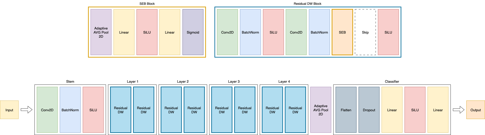

# 🍽️ Fine-Grained Food Classification with CNNs and Self-Supervised Learning

**Authors:**

* Alessandro Dubini – [a.dubini@campus.unimib.it](mailto:a.dubini@campus.unimib.it)
* Elia Leonardo Martin – [e.martin4@campus.unimib.it](mailto:e.martin4@campus.unimib.it)

## 📚 Overview

This project investigates fine-grained food image classification using a lightweight custom CNN architecture. Built and evaluated on a subset of the [FoodX-251 dataset](https://arxiv.org/abs/1907.06167), the model employs advanced architectural elements (residual connections, SE blocks, SiLU activation) to stay under 5M parameters. A comparison between supervised learning and self-supervised learning (SSL) is presented, using jigsaw and geometric pretext tasks.

The best supervised model achieved **51.04% accuracy**, while the SSL approach achieved **45.34%**, demonstrating promising results for feature transfer without labels.

## 🔗 Google Colab

You can run the notebook directly via Google Colab:
📎 [Open in Colab](https://colab.research.google.com/drive/1TPyiSBH-yojvBP8gP1nrtuKrNlOtxw9j?usp=sharing)

---

## 🧠 Project Objectives

* Perform **fine-grained classification** across 251 food categories.
* Design a **lightweight CNN** architecture under 5M parameters.
* Compare **supervised learning** with **self-supervised approaches** using:

  * Jigsaw puzzle resolution
  * Geometric transformation recognition
* Analyze impact of **data quantity and augmentation** on model performance.

---

## 📦 Dataset

**FoodX-251**: A fine-grained dataset with over 158,000 images across 251 food categories.

Due to limited compute resources, a subset was used:

* Training: max 350 images/class
* Validation: max 30 images/class
* Test: Official validation set used as external test

Key challenges:

* High inter-class similarity (e.g. different pasta types)
* High intra-class variability (packaged vs. plated foods)
* Presence of noisy or irrelevant images (e.g. characters named "Nacho")

---

## 🏗️ Architecture

Custom CNN architecture built using:

* **Residual connections** (to mitigate vanishing gradients)
* **Squeeze-and-Excitation blocks** (for channel-wise attention)
* **SiLU activation function** (for smooth gradient flow)

> 🧠 Total parameters: \~2.2M

  

---

## ⚙️ Training Setup

**Supervised Training:**

* Optimizer: `AdamW` (weight decay 1e-4)
* Scheduler: `ReduceLROnPlateau`
* Loss: `CrossEntropyLoss`
* Epochs: 50
* Learning Rate: 0.001

**Self-Supervised Pretext Tasks:**

1. Jigsaw Puzzle (10 epochs)
2. Geometric Transform Recognition (10 epochs)
3. Classification fine-tuning

All experiments used consistent data splits and augmentation for fair comparison.

---

## 📈 Results

| Metric              | Supervised (%) | Self-Supervised (%) |
| ------------------- | -------------- | ------------------- |
| Accuracy            | 51.04          | 45.34               |
| F1 Score (Macro)    | 49.17          | 43.24               |
| F1 Score (Weighted) | 50.94          | 44.85               |
| Precision (Macro)   | 49.83          | 45.43               |
| Recall (Macro)      | 49.55          | 43.67               |

> ✅ Balanced performance across frequent and rare classes
> 🔁 SSL approach yields decent results without using labels

---

## 🛠️ Technologies

* Python
* PyTorch
* Google Colab
* NumPy / Matplotlib
* torchvision (for data transforms)

---

## 🔮 Future Work

* Retrain on full dataset with better hardware
* Explore **contrastive SSL methods** (e.g. SimCLR)
* Fine-tune pretext tasks for more effective feature learning
* Add early stopping and more refined learning rate strategies

---

## 📄 References

* He et al., [Deep Residual Learning for Image Recognition](https://arxiv.org/abs/1512.03385)
* Hu et al., [Squeeze-and-Excitation Networks](https://arxiv.org/abs/1709.01507)
* Kaur et al., [FoodX-251 Dataset](https://arxiv.org/abs/1907.06167)
* Noroozi et al., [Jigsaw SSL](https://arxiv.org/abs/1603.09246)
* Kalel Park, [FG-SSL GitHub](https://github.com/kalelpark/FG-SSL)

---

## 📬 Contact

For questions or collaborations, feel free to reach out:

* Alessandro Dubini – [a.dubini@campus.unimib.it](mailto:a.dubini@campus.unimib.it)
* Elia Leonardo Martin – [e.martin4@campus.unimib.it](mailto:e.martin4@campus.unimib.it)
